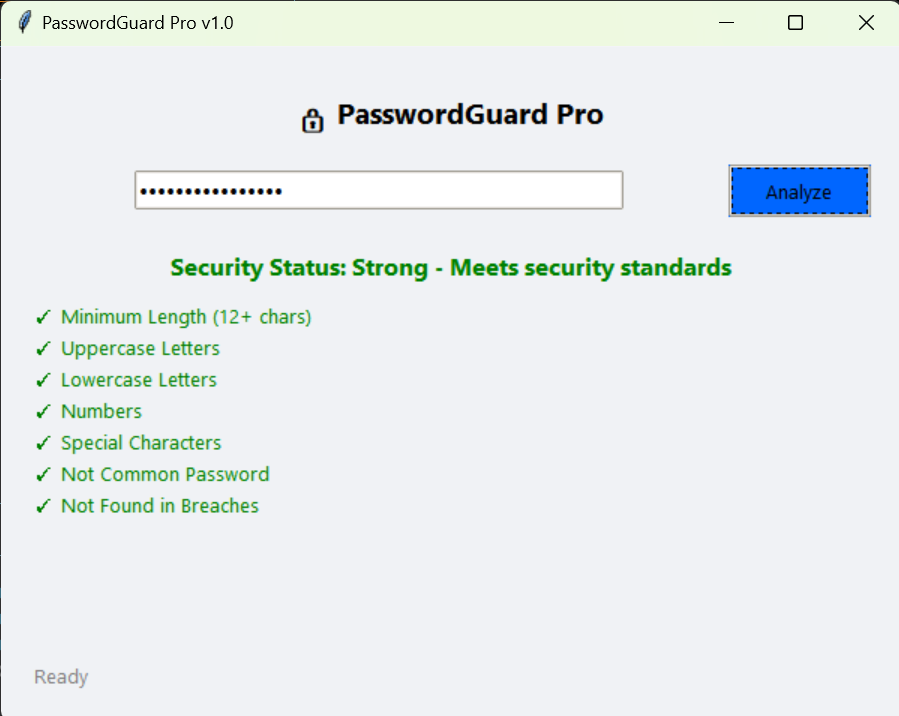

# 🔒 PasswordGuard Pro



Enterprise-grade password security analysis tool with real-time breach detection.

## Features
- SHA-1 Hash-based API Check (Have I Been Pwned)
- OWASP-Compliant Strength Analysis
- Common Password Detection
- Modern Async GUI
- Production-Grade Error Handling

## Installation
```bash
# Clone repository
git clone https://github.com/BlessedBoy-2004/PasswordGuard-Pro.git

# Install dependencies
pip install -r requirements.txt

# Run application
python password_analyzer_gui.py
